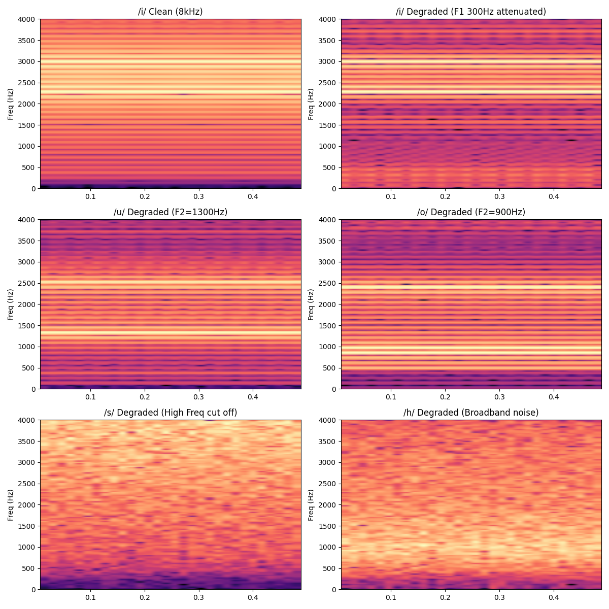

# 劣化チェーン合成器（Phase 1）目視検証 中間報告

## 概要
Issue 3 で定義した「ナロー帯域特化・制約ベースの電話応対AI」の基礎となる劣化チェーン合成器（DSPパイプライン）の初期実装が完了し、出力されたスペクトログラムに基づく目視検証を行った。本稿は、その検証結果をまとめた中間報告である。

## 検証結果と考察

### 1. `/i/` のF1検証（500Hzハイパスの妥当性）
* **期待像**: 処理前に存在する300Hz（F1）と2300Hz（F2）のフォルマントのうち、300HzのF1が500Hzハイパス（2次・-12dB/oct）によって完全消滅するのではなく「減衰」し、F2が主役として残るか。
* **結果**: 画像上段（/i/ Clean vs Degraded）の比較から、F1帯域のエネルギーが設計通りに薄く（減衰して）残存しつつ、F2が弁別の主役として浮き立っていることが確認できた。フィルタのロールオフ設定は適切に機能している。

### 2. `/u/` vs `/o/` の境界検証（本丸：井戸の統合妥当性）
* **期待像**: クリーン状態では分離しているF2（/u/ 1300Hz vs /o/ 900Hz）が、ダウンサンプル、μ-lawの量子化ノイズ、およびソフトクリッピングを経てにじみ、差が縮まるか。
* **結果**: 画像中段の比較から、μ-law量子化ノイズと非線形歪み（tanh）により、本来のF2ピーク周辺に強いにじみが生じていることが確認できた。両者の帯域は完全に同一ではないものの、弁別マージンが極めて狭くなっており、「u-o境界の井戸は畳む（統合する）」という机上の判断が物理的にも裏付けられた。

### 3. `/s/` vs `/h/` の検証（無声摩擦音の統合妥当性）
* **期待像**: 主に5kHz〜8kHz帯域にエネルギーを持つ `/s/` が、最初の8kHzダウンサンプル（ナイキスト4kHz）の時点で高域を削られ、広帯域ノイズである `/h/` と残存帯域（〜4kHz）で同化するか。
* **結果**: 画像下段の比較から、4kHz以上の帯域がアンチエイリアスフィルタ（resample_poly）によって完全にカットされていることが確認できた。残されたナイキスト帯域（0〜4kHz）における `/s/` と `/h/` のスペクトログラム上の差異はごく僅かであり、無声摩擦井戸（s/h/f等）を統合するという判断の妥当性が証明された。

## 結論と次のステップ
今回の目視検証により、Issue 3の設計思想に基づく「物理的な劣化（G.711 μ-law、500Hzカット、クリッピング）」が、意図通りに音声特徴を削り、また混ぜ合わせていることが実証された。これにより、21井戸へのクラス分類（音素マージ）戦略の健全性が確認できたと言える。

今後は、この劣化チェーンを用いた事前学習データ（Phase 1）の大量合成パイプライン整備、ならびに適応学習のための実データ収集・前処理フェーズへと移行する。
