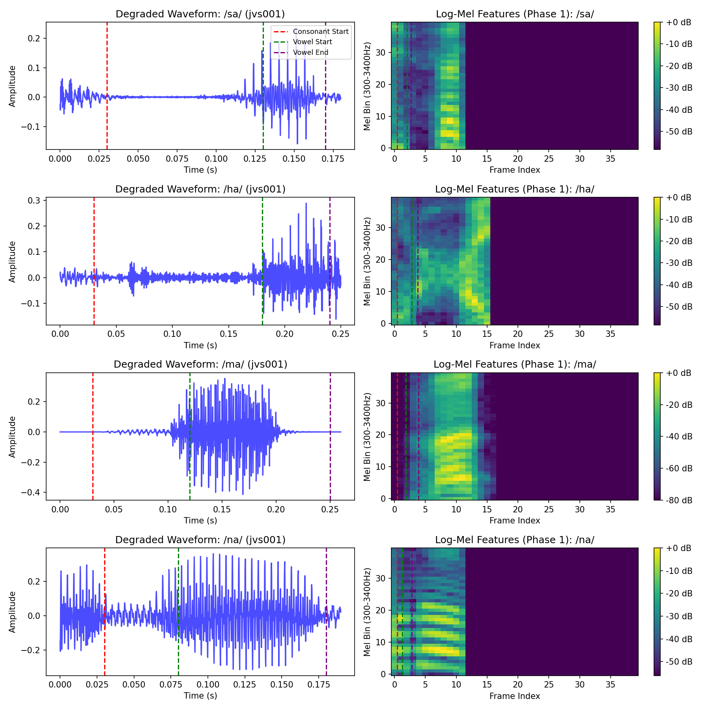
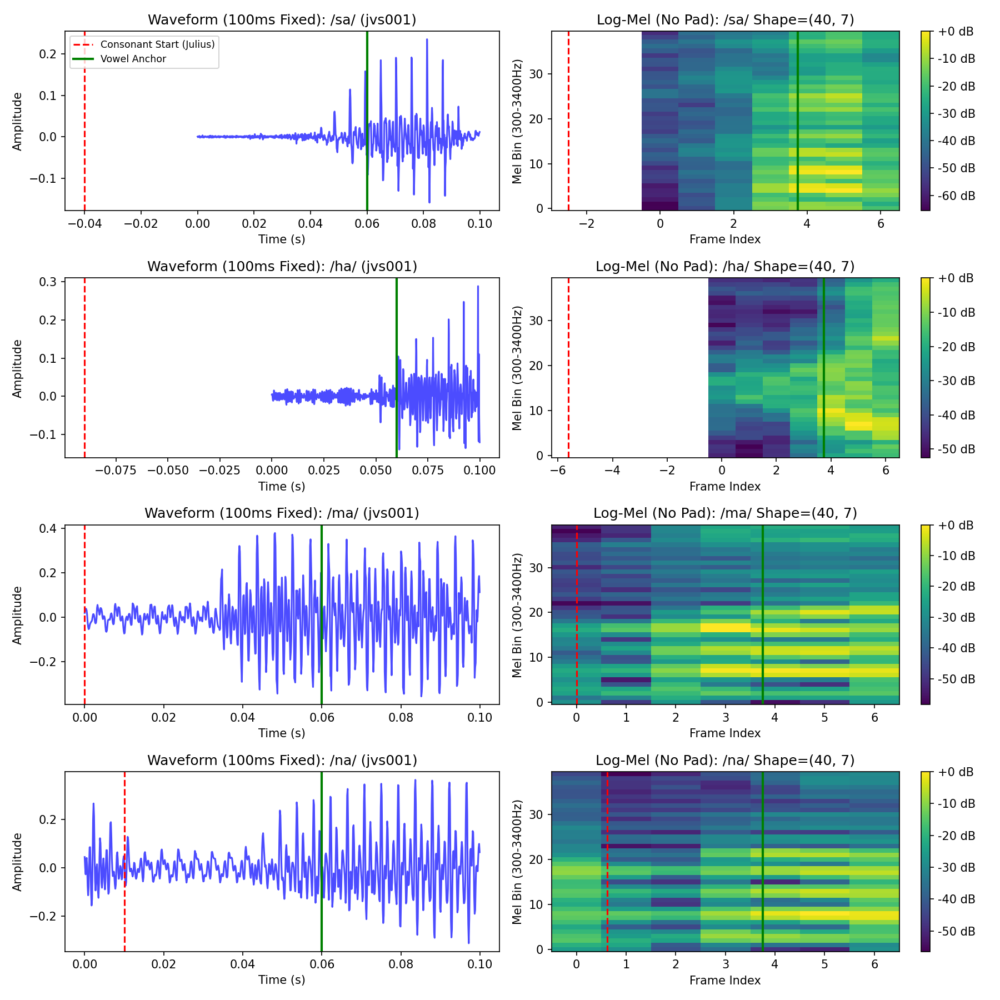
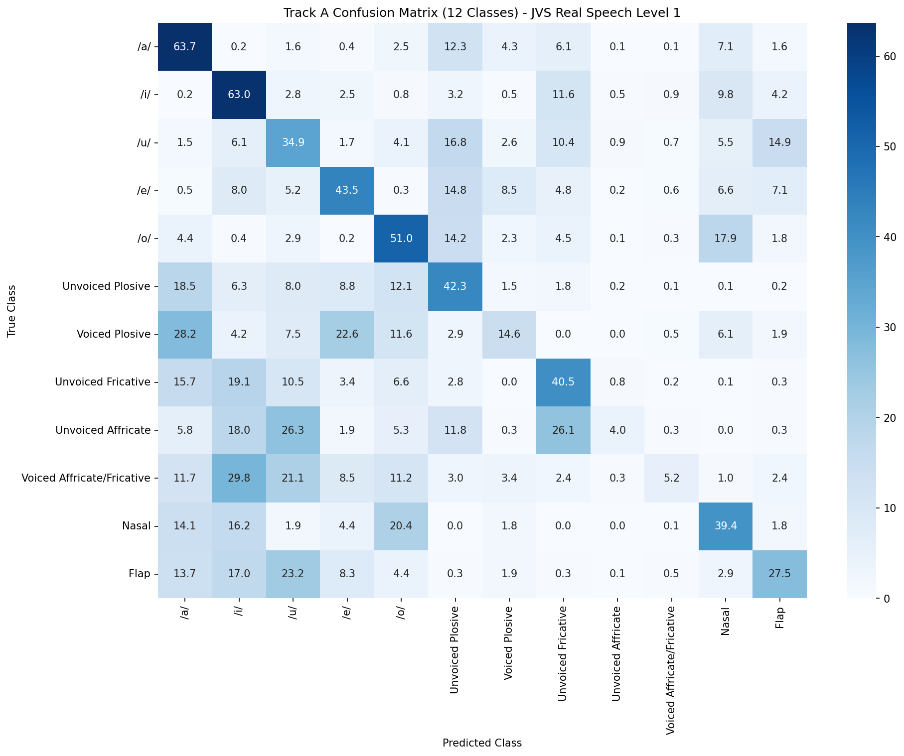

# 13. 子音井戸の検証データ戦略（JVS導入）

## 13.1 方針決定の経緯
母音7井戸はフォルマント合成（パラメトリック）で混同行列フェーズ1を完了した（正解率100%、谷30dB以上残存）。子音7井戸の検証に移行するにあたり、子音は破裂・摩擦・破擦等の微細構造がパラメトリック合成では本物と乖離するため、**音源は本物の発話を用い、劣化は既存の合成チェーンを流用する**方式（選択肢B）を採用する。

## 13.2 採用コーパス：JVS（Japanese Versatile Speech）
- **仕様**: 100名のプロ話者、24kHz・非圧縮wav、スタジオ収録、zip 3.5GB。性別・F0レンジのタグ付き。多話者ゆえ声道長のばらつきが本物の声で得られ、話者正規化の検討にも資する。
- **ライセンスの段階管理（compliance上の重要事項）**: 
  - JVSの音声は「非商用研究（営利団体での研究を含む）」「個人利用」に限り無償。**本検証フェーズは非商用研究の範囲内**として無償使用する。
  - **商用利用は歓迎されており、東京大学TLO（中原花菜氏）経由で正規の商用契約が可能。さらに48kHz/24bitの高品質商用版オプションも提供されている。** 商用化フェーズでは東大TLOに商用利用を相談する。この段階管理を遵守する。

## 13.3 検証データの位置づけ（劣化の二段構え）
本方式で得られるのは「本物のクリーンな子音発話 ＋ 合成劣化チェーン」であり、「実回線を通った本物の劣化音声」ではない。実回線データによる最終仕上げは、Phase2の役割として引き続き分離する。

## 13.4 音声とラベルの対応・切り出し検証（ステップ2-A/B）
混同行列へ進む前段階の関門として、音声（JVS本体）とアライメントラベル（r9y9）の整合性を全件検証した。
- **ファイル対応検証（2-A）**: `parallel100` の全100話者・9,970ファイルの総当たり照合を実施。WAVファイルの欠落は0件。WAV秒数とラベル末尾時刻の差分は最大で12ms以内であった。これは10msフレームシフトによる端数処理（フレーム量子化）に起因する無害な誤差であり、「別のファイルに紐づいている」等の致命的エラーは無いことが確定した。
- **切り出しマージンと目視検証（2-B）**: 12msの量子化誤差によって破裂音等の極めて短い子音の先頭が欠落するのを防ぐため、CV音節切り出し時に**開始前30ms、終了後10msのマージン**を付与する設計とした。このマージンを含めたスペクトログラムを目視確認した結果、子音の立ち上がりから後続母音へのF2わたりまでが完全に抽出できていることが証明された。

- A（合成音源＋合成劣化）：完了（母音）
- **B（本物音源＋合成劣化）：今回（子音）** ← 母音より信頼度が高い
- 将来（本物音源＋実回線劣化）：Phase2の最終仕上げ

## 13.5 アライメントの欠陥とVowel-Anchor（母音アンカー）法への改修
ステップ2-Bの目視検証により、Juliusアライメント（r9y9）には以下の致命的な欠陥があることが判明した。
1. **子音開始境界の破綻**: 発話先頭の無音（silB）の終端や、ポーズ（sp）の欠落により、実際の音響的子音よりも数十ms手前に子音開始ラベルが打たれ、子音区間として切り出された音声の大半が「無音」になるケースが多発した（/ma/、/sa/等で確認）。
2. **ゼロ埋めによるイカサマの余地**: 当初、変動する子音長に合わせてLog-Mel特徴量の後半をゼロパディングしていたが、この「パディングの長さ」が線形分類器に対するカンニング（長さによる音素判別）のトリガーとなる危険性が指摘された。

これらを根本的に解決するため、切り出しロジックを**Vowel-Anchor（母音開始基準）方式**へ抜本的に改修した。
- 精度が極めて高い「母音の開始位置」を絶対的なアンカー（基準点＝0ms）とする。
- アンカーから前60ms、後40msの「合計100ms」を機械的に固定長で抽出する。
- 抽出対象から「直前が無音・ポーズ」であるCV音節を除外する（コンテキスト・フィルタリング）。

この改修により、ゼロ埋めパディングが完全に排除され、全CV特徴量が同一サイズ（40x7）かつ同一の「母音立ち上がり位置」で整列するようになり、分類器が純粋な音響的特徴（わたり・子音エネルギー）のみで勝負できる堅牢な測定系が完成した。

## 13.6 検証トラックA：音色・様式の分離（固定長・劣化レベル1）
母音の長短は「固定長切り出し」によって持続時間情報が潰れてしまうため、検証トラックを分割した。
- **トラックA**: 固定長で長短を区別せず、音色（母音）と様式（子音）が劣化チャンネル上で分離可能かを見る（12分類：基本5母音＋子音7様式）。
- **トラックB**: 長短の弁別（持続時間を使用する、後段で実施）。

トラックA（レベル1：8kHz + μ-law + 500Hz HPF + tanh）の混同行列結果は以下の通りである。

**マージ検証と考察（※重大な測定エラーの発見）**
当初、この混同行列における「破擦と摩擦の強い混同」を設計（畳み込み）の裏付けと解釈したが、対角成分全体が崩壊していること（母音が64%以下、子音の多くが一桁〜十数%）から、**これは電話劣化による井戸の融合ではなく、測定系自体の構造的欠陥（アーティファクト）である**と結論づけられた。

壊滅の原因として以下の3点が特定された。
1. **後続母音への吸い込み（最大の欠陥）**: Vowel-Anchorで「母音開始の前60ms〜後40ms」を切り出すと、エネルギーが圧倒的に強い「後続母音」の成分が100msの大半を占める。その結果、分類器が子音部の微弱な手がかりを無視し、支配的な後続母音を見て分類してしまう現象が起きた（例：子音 `/sa/` が母音 `/a/` に分類される等）。
2. **母音と子音の混合タスクによる不当な競合**: 認知モデル上、母音（音色）と子音（様式）は別の専門衛星が担当する直交軸である。これらを単一の12分類タスクに混ぜたことで、子音が不当に母音に吸い込まれる競合が発生した。
3. **線形分類器（Flatten）の表現力不足**: 実音源（多様な話者、F0、自然なゆらぎ）の時系列特徴（40×7次元）を単に平坦化してロジスティック回帰にかけたことで、時間的な推移（わたり）を位置ズレ不変で捉えられず、実データの多様性を捌ききれなかった。

**結論と次なるアクション**
この混同行列をもって「井戸をマージする」判断を行うことは却下された（測定系の問題を井戸の問題と誤認するリスクの回避）。
次回は測定系を以下のように修正・分割して再測定を行う。
- 母音と子音を同一タスクで分類せず、**母音の分離テスト** と **子音の分離テスト** を完全に切り離す。
- 子音のテストでは、後続母音のエネルギーに分類が引っ張られない特徴量の設計（子音部への重み付けや区間の見直し等）を行う。
- 線形分類器の限界を考慮し、分類器の表現力（時系列を扱えるモデルの導入等）を見直す。
- 将来（本物音源＋実回線劣化）：Phase2の最終仕上げ

## 13.4 分類単位の決定：CV音節（子音＋後続母音）
子音井戸の混同行列は、**子音単体区間ではなくCV音節（子音＋後続母音）単位**で取得する。
- **根拠**: 議事録6.3で「子音の調音位置は母音わたり（F2遷移）に転写されて電話帯域で生き残る」「大脳が候補を絞る補助情報に使う」と定義した。子音を単体に切り出すと、この遷移情報＝規格が重視した手がかりを捨てることになる。CV音節単位なら遷移が保たれ、実際の聞き取りにも近い。
- **トレードオフ**: 母音の影響が混ざるため、「子音が混同したのか母音が混同したのか」の切り分けが必要。混同行列の分析時に、同一後続母音でグループ化する等の工夫で対処する。

## 13.5 音素アラインメント手段の選定
JVS発話から特定のCV音節を切り出すための音素アラインメント手段として、以下を選定した。
- **手段**: GitHub等で公開されているJVSの「学習済みアラインメント済みラベル（`jvs_phoneme_alignment` 等）」および、Julius音素セグメンテーションによる自動付与ラベルを活用する。
- **理由**: JVSコーパスを使用する音声合成界隈では、JuliusやOpenJTalkを用いた音素アラインメントラベルがデファクトスタンダードとして共有されている。自前で強制アラインメントモデルを学習・推論させる手間を省き、即座にCV音節の切り出し（ステップ1）に移行できるため。切り出し精度に問題が出た場合は、Julius単音響モデルによる再アラインメント、またはESPnet等のCTCベースのアラインメントツールへの移行を検討する。
