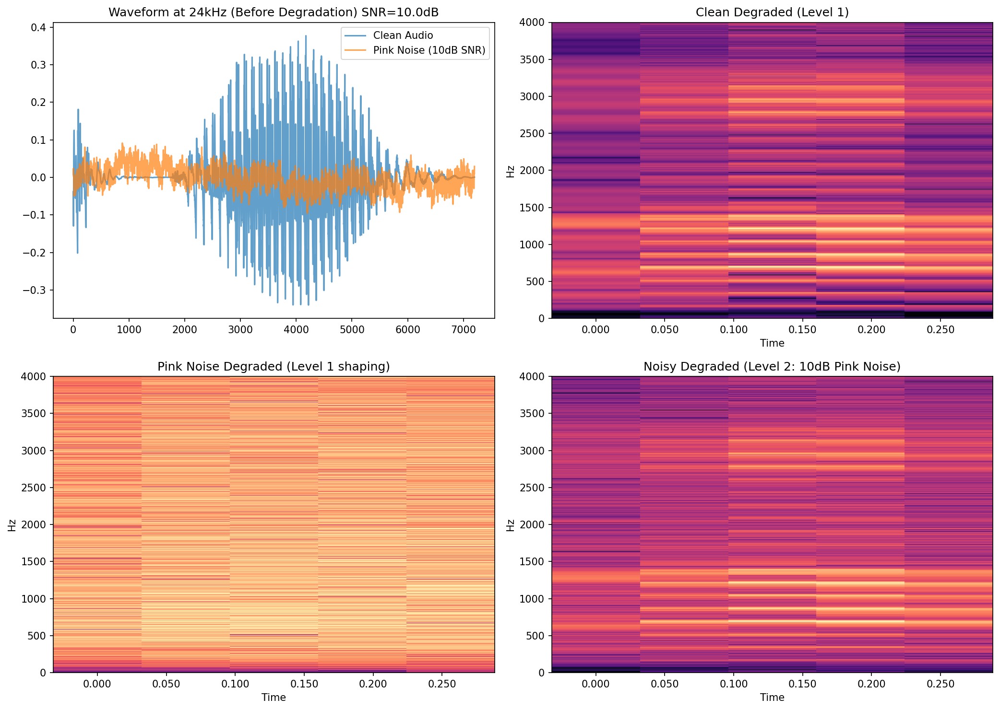

# 6. Level 2 (背景雑音) テスト計画と結果

## 6.1 テストの目的
トラックA・レベル1（クリーンな帯域制限環境）での検証が完了し、本規格のベースラインとなる「10分類（母音5 ＋ 子音様式5）」の井戸が暫定確定した。
本テスト（レベル2）の目的は、この10分類が**現実の背景雑音下において、どの程度のSNR（信号対雑音比）まで頑健性を保てるか**を測ることである。

## 6.2 劣化のアーキテクチャ（挿入位置）
現実の電話環境（送話側雑音）を物理的に正しくシミュレートするため、雑音は以下の順序で挿入される。
1. クリーンな原音（24kHz）に背景雑音を指定のSNRで加算する。
2. 雑音が重畳された信号に対し、レベル1の劣化パイプライン（500Hz HPF → 8kHzダウンサンプリング → μ-lawエンコード/デコード）を適用する。
これにより、背景雑音自身も電話帯域の制約（帯域制限と量子化雑音）を受ける現実的な挙動となる。

## 6.3 テスト仕様
- **雑音源**: 
  - **Phase 2.1**: 定常雑音（Pink Noise）。雑音のスペクトル特性が単純であるため、井戸の崩れ方を切り分けるためのベースラインとして使用する。
  - **Phase 2.2**: 実環境雑音（MUSANコーパス等）。Phase 2.1完了後にライセンスを確認し、現実の多様な雑音でテストする。
- **テストSNR**: ∞ (Clean), 20dB, 10dB, 5dB, 0dB
  - 特定の1点ではなく、複数のSNRで「崩れ方の曲線（SNR耐性曲線）」を取得し、各井戸がどの順序で崩れていくかを可視化する。
- **検証仮説**: 
  - 「母音は中域にエネルギーが集中しているため雑音に粘り強く、子音（特に高周波や過渡的な特徴に依存するもの）は先に崩れる」という、本規格の基本方針が雑音下でも成立するかを検証する。

## 6.4 測定における品質管理（実装上の注意と留保）
レベル2テストを実装・評価するにあたり、以下の2点を「測定の定義」として固定し、バイアスを予防する。

1. **SNRの定義と実効SNRの非対称性**
   - **定義**: SNR（信号対雑音比）は、「CV音節区間全体の音声RMSパワー」と「同区間の雑音RMSパワー」の比率で定義する。
   - **留保**: この定義下において、子音部（特に無声破裂や摩擦）は母音部よりも生得的にパワーが小さいため、**子音部の実効SNRは表示値よりも悪くなる（雑音に埋もれやすい）**。今後「子音が先に崩れた」という結果が出た際、それが「子音の音響的性質が脆いから」なのか「単に実効SNRが低かったから」なのかが入り混じることを認識した上で、結果を解釈する。
2. **雑音の帯域整形（送話側雑音の物理的シミュレーション）**
   - 雑音はクリーン音源に重畳された「直後に」レベル1劣化（500Hz HPF、ダウンサンプル、μ-law）を受ける。
   - 特に定常雑音（Pink Noise）は低域パワーが強いため、500Hz HPFによって低域が大きく削り取られる。本測定の前に、劣化後のスペクトログラムを目視確認し、雑音が正しく帯域制限を受け、かつ意図したSNR感になっているかを検証する。

### 6.4.1 雑音の帯域整形の目視確認（10dB Pink Noise）
本測定の前に、定常雑音（Pink Noise）が物理的に正しくレベル1の帯域制限（500Hz HPF）を受けているかを目視で確認した。

- 左下（Pink Noise Degraded）の通り、Pink Noise特有の低域エネルギーが500HzのHPFによって完全に削り取られている。
- これにより、計算上の10dBよりも「分類器から見た実効的なSNR」はやや改善される形となるが、これが「送話側雑音（電話機に入る前の環境音）」の物理的に正しい挙動である。

## 6.5 テスト結果 (Pink Noise)
*(本測定の実行後に追記)*
