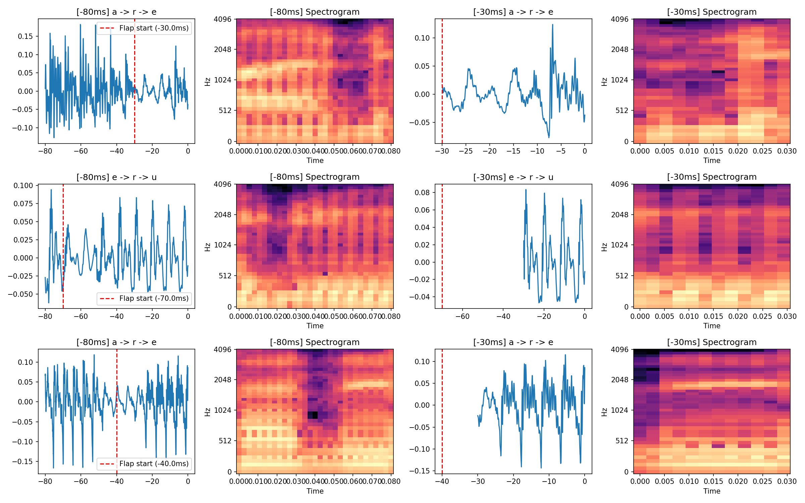
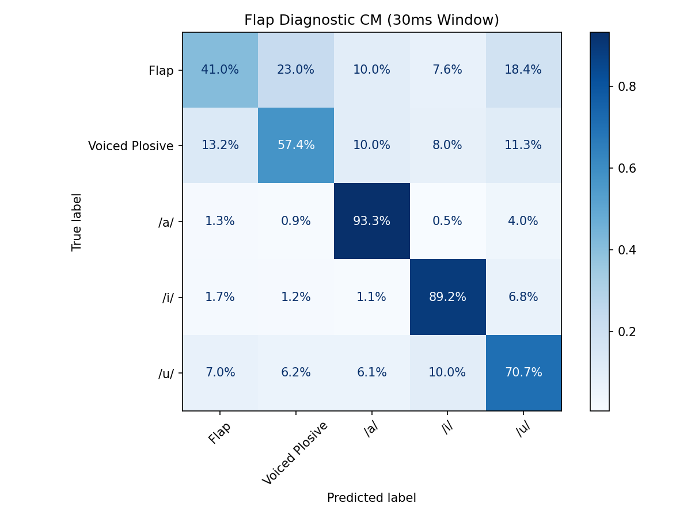
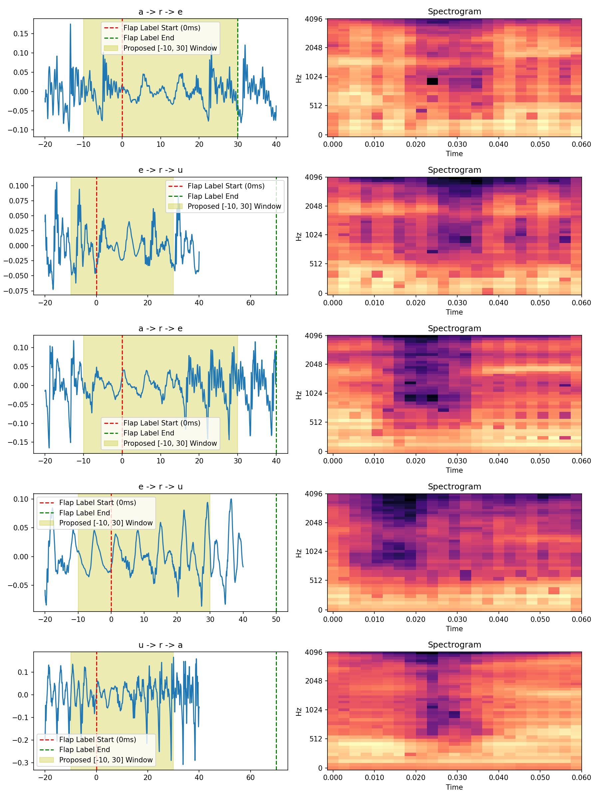
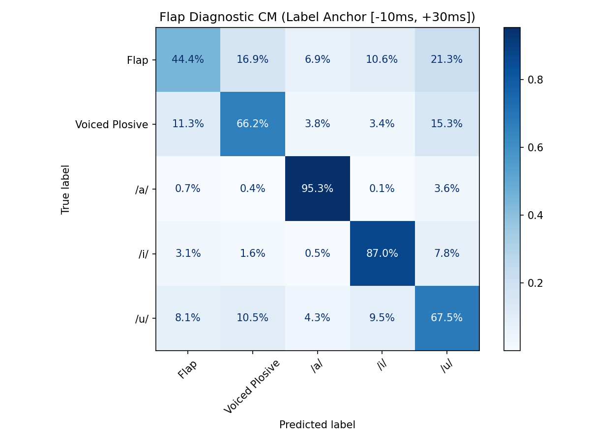

# 15. レベル1立ち返り検証：脆い井戸の診断とアーティファクト排除

レベル2（雑音重畳）への移行後、「クリーン環境（レベル1）の時点から既に極端に分離度が低い井戸が存在する」という事実が浮上したため、レベル2を一時停止し、レベル1に戻って10分類の分離度を序列化。下位の井戸（弾き音、/u/、有声破裂）について原因を診断した。

## 15.1 10分類のクリーン分離度ランキング
10分類を同時に線形分類（80ms窓）した際の正答率は以下の通り二極化した。
- **健全 (70%超)**: `/a/` (89.8%), `/o/` (82.6%), `Nasal` (80.9%), `Unvoiced Plosive` (78.9%), `/e/` (78.1%), `Unvoiced Fricative` (74.4%), `/i/` (72.2%)
- **脆い (50%前後以下)**: `Voiced Plosive` (50.1%), `/u/` (47.1%), `Flap` (42.2%)

## 15.2 脆い井戸の散り方と原因の切り分け
1. **弾き音 (Flap: 42.2%)**
   - **散り先**: `/a/` (14.5%), `/u/` (14.5%), `/i/` (10.6%), `Voiced Plosive` (7.6%)
   - **診断結果（測定アーティファクト）**: 誤分類の約40%が先行母音へ散っている。弾き音 [ɾ] は持続時間（20〜30ms）が極めて短いため、固定長80ms窓 `[-80ms, 0ms]` の大部分が「直前の母音」で埋め尽くされてしまい、分類器が先行母音を拾ってしまっていることが確定した。
2. **閉口母音 /u/ (47.1%)**
   - **散り先**: `/e/` (8.3%), `/o/` (7.4%), `Unvoiced Plosive` (7.0%), `Nasal` (6.6%), `Flap` (6.2%) など全方位
   - **診断結果（本質的な脆さ）**: 日本語の /u/ は元々エネルギーが弱く、さらに500Hz HPFによって要となるF1が削られるため、スペクトル上の明確なピークが消失。「弱いノイズ」のように見え、全方位の子音・母音と区別がつかなくなっている。

## 15.3 弾き音の窓アーティファクト診断と目視確認
「先行母音の吸い込み」というアーティファクトを排除するため、後続母音アンカーからの抽出窓を従来の `[-80ms, 0ms]` から `[-30ms, 0ms]` へ短縮し、弾き音が正しく切り出せるかを目視確認およびサブ分類（弾き音 vs 混同先）で診断した。

**1. 抽出窓の目視確認**

- 赤線がJuliusアライメントによる実際の弾き音（r）の開始位置。
- `-80ms`（左側）では先行母音を大量に吸い込んでいるが、`-30ms`（右側）では、サンプルの発話タイミングの揺らぎにより、**弾き音の肝心な閉鎖・開放の瞬間が窓から見切れている**ケースが散見された。後続母音アンカーからの固定長マイナスでは、弾き音を安定して捉えられないことが判明。

**2. 短い窓（30ms）での分離診断（サブ分類）**

- 30ms窓で弾き音と混同先（/a/, /i/, /u/, 有声破裂）を次元を揃えて分類した結果、弾き音の正答率は **41.0%** に留まった。
- 先行母音への混同は減ったものの、肝心の特徴が切り落とされた結果、「有声破裂」への混同が急増した。

## 15.4 【結論】脆い井戸の最終的な処遇と次のアクション

1. **弾き音の窓再修正（アンカーの変更）**
   - 弾き音の窓問題は「長さを変える」だけでは解決せず、「基準点」が問題であることが確定した。
   - 次は破裂音のバースト基準と同様に、**弾き音のラベル開始位置をアンカーとした抽出（例: `[-10ms, +30ms]` 等）**を試し、弾き音が真に分離可能か（井戸として成立するか）を最終診断する。

2. **閉口母音 /u/ の維持と上位レイヤーでの吸収**
   - /u/ の本質的脆さは予言通り（議事録6.1）であり、母音として必須であるため**維持**する。
   - 分類器の精度低下（混同行列での散り）は、F2の優先、信頼度割引、そして上位レイヤー（大脳＋衛星）による確認フローの自動トリガーとしてシステム全体で吸収する（議事録6.4の既定方針の再確認）。

## 15.5 弾き音ラベル基準抽出による真の分離診断（最終確定）

前節のアクションに基づき、弾き音のJuliusラベル（.lab）開始位置をアンカーとした `[-10ms, +30ms]` の専用窓を用いて、アーティファクトを完全に排除した真の分離診断を実施した。

**1. ラベル基準窓の目視確認**

- 赤線（ラベル開始位置）が実際の「音響的な谷（閉鎖）および直後の立ち上がり（開放）」と正確に一致しており、先行母音の定常部を綺麗に切り落として弾き音のコアを捕捉できていることが確認された。

**2. ラベル基準窓での分離診断（サブ分類）**

- 窓のアーティファクトを排除した結果、弾き音の正答率は **44.4%** であり、本質的な分離能の欠如が確認された。
- 誤分類先を見ると、有声破裂（16.9%）と /u/（21.3%）の両方に流れている。「先行母音への散り（40%）」という純粋な窓アーティファクトは消滅したが、/u/ 等の母音への流入は残存した。これは後続母音の残存、あるいは弾き音の母音的性質によるものと考えられる。

**【最終結論：弾き音の脆さと有声破裂へのマージ確定】**
弾き音はラベル基準窓（アーティファクト排除後）でも44.4%に留まり、井戸として独立分離できない脆さが確定した。
誤分類先として /u/ (21.3%) が最大であるものの、弾き音は「子音」であり母音へ統合することはありえない。子音様式の中での帰属先を見ると「有声破裂 (16.9%)」が突出している。
弾き音 [ɾ] と有声破裂 [d] は調音的にごく近く（同じ歯茎の閉鎖・開放）、電話帯域で低域（閉鎖の手がかり）が削られると、一瞬の弾きと一瞬の破裂が区別しにくくなるという音声学的な裏付けとも一致する。
よって、弾き音は **有声破裂へマージする** ことが確定した（※線形・レベル1という留保付き）。

## 15.6 レベル2への波及
弾き音が有声破裂へマージされることが確定したため、レベル2の「SNR曲線」も、この新たな編成（弾き音を有声破裂に含めた9分類体制）のもとで再測定し、真の耐久テストを実施する。
