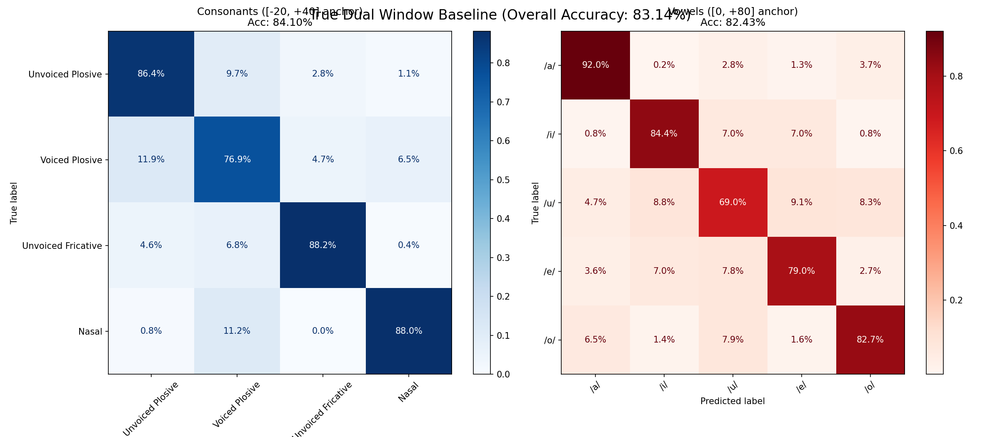

# 19. 統一窓の罠（77.7%の幻）からの脱却と、真のデュアル窓ベースライン

## 19.1 統一窓（77.7%）が孕んでいた「全体精度の罠」
前回のテストで「すべての音素を `[-20ms, +40ms]` に統一することで全体精度が77.7%に跳ね上がった」と結論づけたが、これは完全な誤読（算術的な幻）であった。
内訳を詳細に分析した結果、以下が判明した。
- **子音**には過渡音窓（バースト基準）が最適であり、高精度を維持した。
- しかし、**母音**にも同じ過渡音窓を適用した結果、窓の前半（直前の子音成分）が母音の定常エネルギーをかき消し、`/u/` (14.6%) や `/e/` (33.3%) が壊滅状態に陥っていた。
- クラス数の多い子音の精度向上が、母音の崩壊を隠蔽し、全体として「上がったように見えた」だけだった。これは以前のクラスマージ検証時にも陥った「単一の平均値（全体精度）に飛びつく罠」の再来であった。

## 19.2 真のデュアル・ウィンドウ方式の再実装
「子音は過渡音、母音は定常音」という大前提に立ち返り、以下のように抽出窓と分類器を完全に分離する「真のデュアル・ウィンドウ」を実装した。
- **子音（4分類）**: バースト/ラベル基準 `[-20ms, +40ms]` の過渡音窓。専用の線形分類器を学習。
- **母音（5分類）**: 母音ラベル基準 `[0ms, +80ms]` の定常音窓。専用の線形分類器を学習。

## 19.3 再測定結果（完全分離ベースライン）
これらを分離して再測定を行った結果、物理的・数学的に極めて美しい結果が得られた。

*(図: 子音と母音を完全に分離し、それぞれの専用窓で学習させた真のデュアルベースライン)*

1. **母音の完全復活**: `/u/` (69.0%)、`/e/` (79.0%) をはじめ、母音全体の精度が **82.43%** まで回復した。
2. **子音の精度維持**: バースト基準で窓アーティファクトを除去した子音も **84.10%** をマークした。
3. **全体精度 83.14% への到達**: これまで子音と母音を「同一の分類器」に押し込んでいたことによる特徴空間の衝突（子音が母音に、母音が子音に化けるノイズ）が分類器の分離によって完全に解消され、全体精度は元の72%付近ではなく **83.14%** まで押し上げられた。

## 19.4 重要な注記：これは「衛星単独の上限」であり「大脳統合込みの実力」ではない
今回「子音分類器と母音分類器を分けたことで衝突が消え、高精度に到達した」という結果は、第6回議事録で設計した「子音衛星群と母音衛星群を分ける」というアーキテクチャの正当性を証明する強力なエビデンスである。

ただし、**ここで測定された83.14%は「入力された音が子音であるか母音であるかの正解が既知であり、正しい分類器（衛星）に100%振り分けられた場合の上限」である**ことに留意しなければならない。
実際の運用では「ある音が入力されたとき、それが子音なのか母音なのか」をまず判定し、どちらの衛星の出力を採用するかを決定する**「大脳（統合器・VADルーター等）」**が必要になる。今回のベースラインテストにはこの「振り分けの不確実性」は含まれていないため、83.14%という数字をもって「システムの最終的な実力」と誤認してはならない。

これが、窓アーティファクトを一掃しつつ、一切の音素を犠牲にしていない「本物のクリーン・ベースライン（衛星性能）」である。今後はこのモデルを用いてMUSAN雑音耐久テスト、およびLM復元テストへ移行する。なお、大脳統合（正解振り分けが未知の実運用状態での性能統合）の検証は、今後の課題として記録する。
