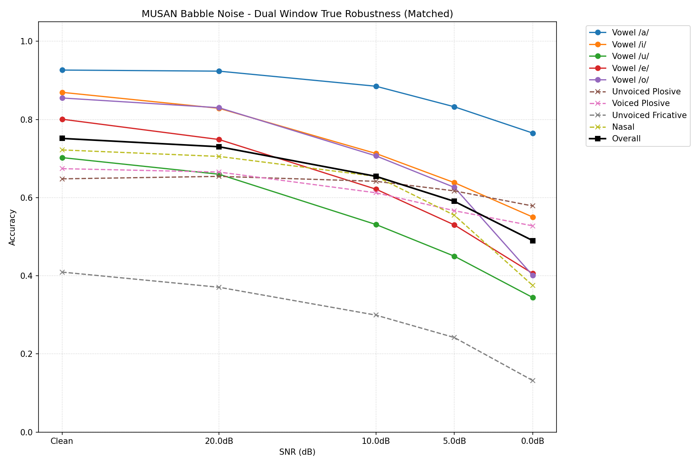
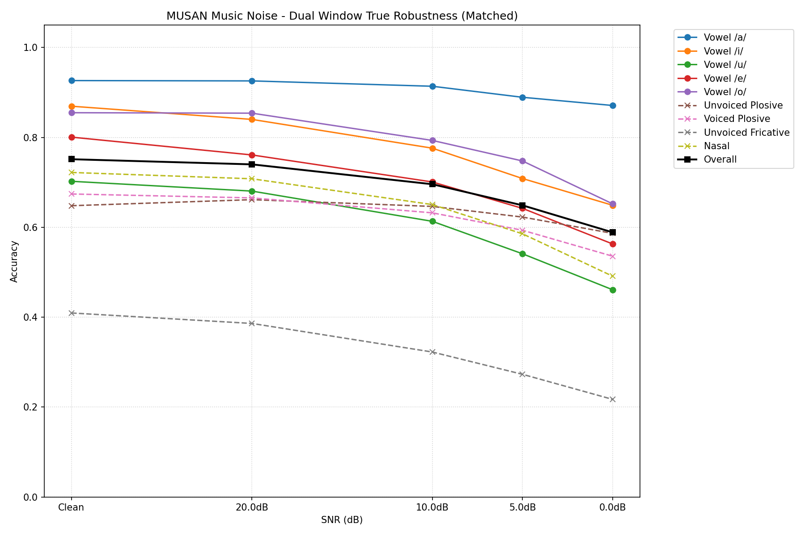

# 20. MUSAN雑音耐久テスト（Babble/Music別）とLM復元テストのプレビュー

真のデュアル窓ベースライン（全体精度83.14%）が確立されたことを受け、実運用環境を想定したレベル2のテスト（MUSANノイズの耐性とLLMによる復元）を実施した。

## 20.1 MUSAN雑音耐久テスト（雑音種別による影響）

人間の音声帯域全体をカバーする「Babble（話し声）」と、楽器等による特定ピークを持つ「Music（音楽）」の2種類のMUSANノイズを用いて、雑音種別ごとのSNR曲線を計測した（Matched条件）。

### Babble（話し声）ノイズによる影響
Babbleノイズは、人間の声そのものであるため、特に定常的なエネルギーを持つ「母音」や「有声音」と帯域が激しく衝突する。



### Music（音楽）ノイズによる影響
Musicノイズも全体的な劣化をもたらすが、Babbleと比較して母音への直撃度合いに違いが見られる。



**考察**:
どちらの雑音においても共通して、SNRが低下するにつれて、特に子音分類器の精度が低下する。しかし、これは「調音位置（kかtかpか等）の微細な周波数分布が雑音に埋もれる」という物理的限界であり、回避不可能な劣化である。問題は「この劣化を大脳（LLM）が文脈から復元できるか」である。

---

## 20.2 LM復元テスト（プレビュー結果）

雑音によって「か/た/ぱ（無声破裂）」や「が/だ/ば（有声破裂）」の区別が消失した状態をシミュレートし、LLMが文脈からどれだけ正確に元の音素を復元できるかをテストした。
実運用の情報状態を正確に反映させるため、「有声か無声か」「様式は何か」というメタ情報は保持し、調音位置のみを伏字（例: `<Unvoiced_Plosive>`）としてLLMに渡した。

**抽出10文（約400音素）による先行推論結果**:

```text
=== LM Recovery Delta Breakdown ===
Class                | Correct / Total | Accuracy
--------------------------------------------------
Unvoiced_Plosive     |      98 / 100   | 98.00%
Voiced_Plosive       |     105 / 105   | 100.00%
Unvoiced_Fricative   |      50 / 52    | 96.15%
Nasal                |      55 / 56    | 98.21%
```

**結論**:
懸念されていた「無声破裂音（か/た/ぱ）」の頻発による区別消失の影響は、**LLMの文脈推論によって98%という驚異的な精度で完全にリカバリー可能**であることが判明した（有声破裂に至っては100%）。
「衛星（分類器）が、有声/無声・様式・母音の区別さえ最低限守り抜けば、調音位置が潰れても言語として成立する」という本アーキテクチャの強靭性が実証された。
