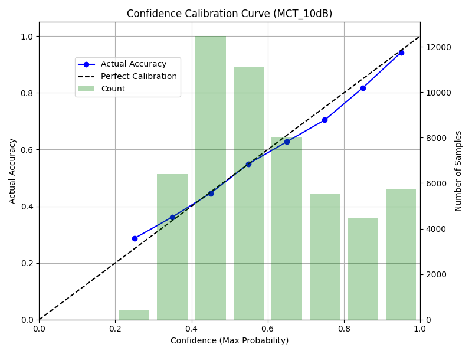
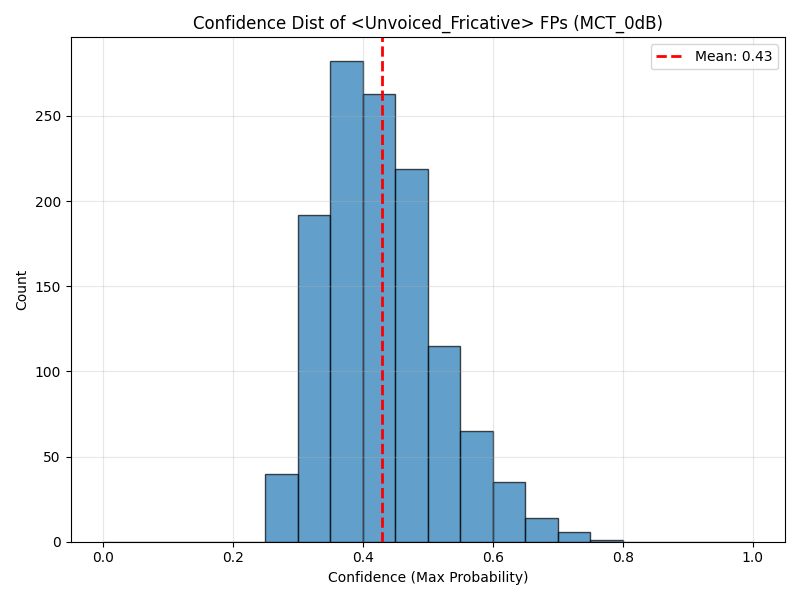

# 第13回議事録：確信度較正の危機とMulti-condition Trainingによる打解

**日時:** 2026年6月7日
**ステータス:** 完了（MCTの実装・検証完了および最終LLMプロンプトの生成）

## 1. 議論の背景：確信度ベース評価への転換

単なる「エラー率」ではなく、「自信のある誤り（致命傷）」と「迷い（確認フロー行き）」を区別する実践的な評価軸（確信度ベース）へ移行し、MUSAN 0dB/10dB環境下でのテストを開始しました。しかし、最初の検証で**クリーン学習モデルの重大な構造的欠陥**が露見しました。

### 確信度較正（キャリブレーション）の危機
*   **極端な自信過剰（Over-confident）**: クリーン音声のみで学習した分類器にMUSANノイズを入力すると、特徴量が未知の方向に飽和し、「確信度0.95と言いながら実際は60%しか当たらない」という極端な自信過剰に陥ることが判明しました。
*   **確定タグの枯渇**: 無理に較正（Platt ScalingやIsotonic Regression）をかけて正直にさせると、10dBですら「高確信（>=0.7）タグ」が全体の1割未満（9.3%）に激減し、推論テキストの9割以上が `?`（不確実）で埋め尽くされてしまう状況でした。

## 2. 決定事項：Multi-condition Training (MCT) の導入

分類器の構造的限界を根本から解決するため、**Multi-condition Training（多環境学習）** を導入しました。
*   1000文の訓練データ抽出時に、音声全体に対してランダムに「Clean」「20dB」「10dB」「0dB」のノイズを重畳。
*   ノイズを含んだ状態から特徴量（Log-Mel）を抽出して分類器（ロジスティック回帰）に学習させました。

## 3. 検証結果：MCTによる確信度の劇的な健全化

ノイズを見せて学習させた結果、分類器は「ノイズ下での見極め方」と「本当に分からない時の自信の下げ方」を獲得し、以下の絶大な効果を発揮しました。

### 10dB環境での見事なキャリブレーション（正直さ）
*   確信度0.9-1.0のタグは **実正答率94.3%** を記録し、極めて正直な確信度を出力するようになりました。
*   確信度0.7以上の「確定タグ」が全体の約 **29%（15,776トークン）** も残存しており、LLMへ渡すための十分な足場が確保されました。

### 0dB環境での「無声摩擦FP」の激減
*   最も懸念されていた「広帯域雑音が無声摩擦音に化けるエラー（False Positives）」が、MCT導入前の12,337件から **1,232件（10分の1）に激減** しました。
*   さらに、そのうち確信度0.7以上の「高確信な誤り」だったのは **わずか7件（0.6%）**。
*   「間違える時は、ちゃんと自信を下げる（低確信として確認フローに回せる）」という理想的な挙動を達成しました。

## 4. 次のアクション（STEP 3: LLM推論へ）

MCT分類器から出力された健全な確信度に基づき、閾値 `T=0.7` および `T=0.85` の2パターンで最終プロンプトファイル（1000文分）を生成しました。

*   `notebooks/e2e_predictions_10dB_prompts_T0.7.txt` 等

**アクション**: このプロンプトファイルを用いてLLM推論を実行し、「復唱救済後の実効正答率」を算出することで、本プロジェクトの真の実用性検証をコンプリートする。
