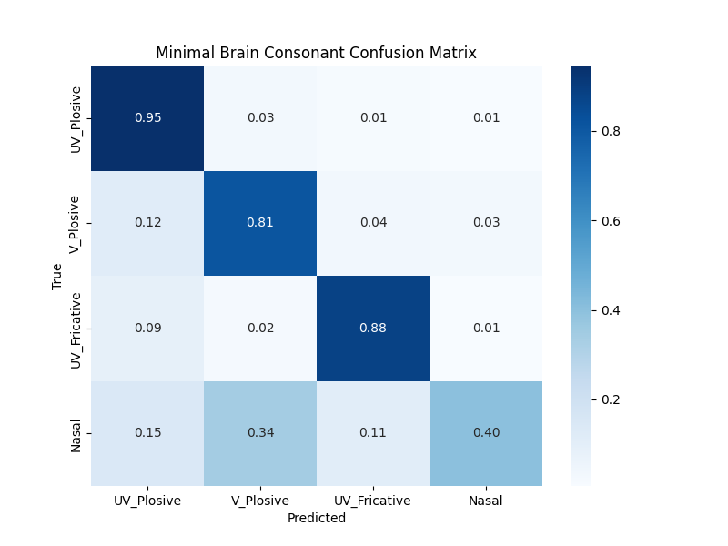
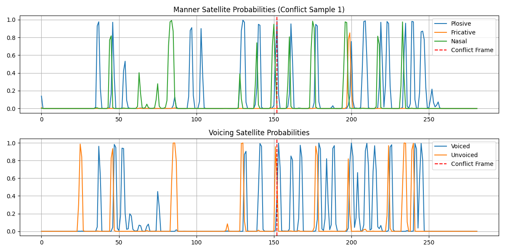
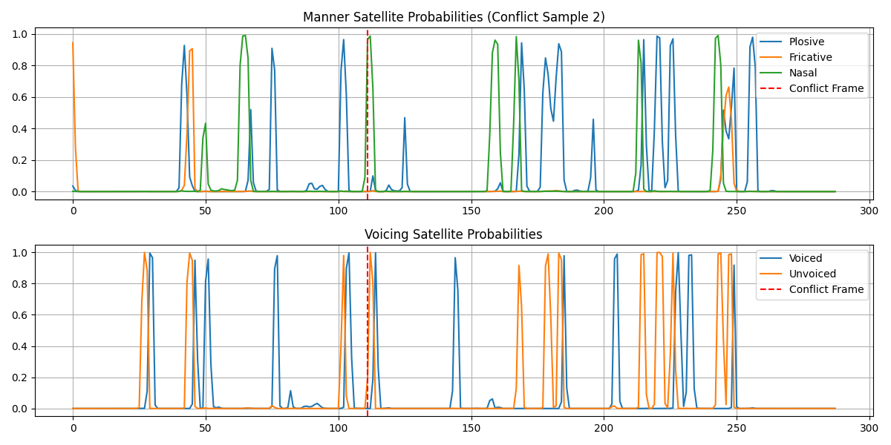
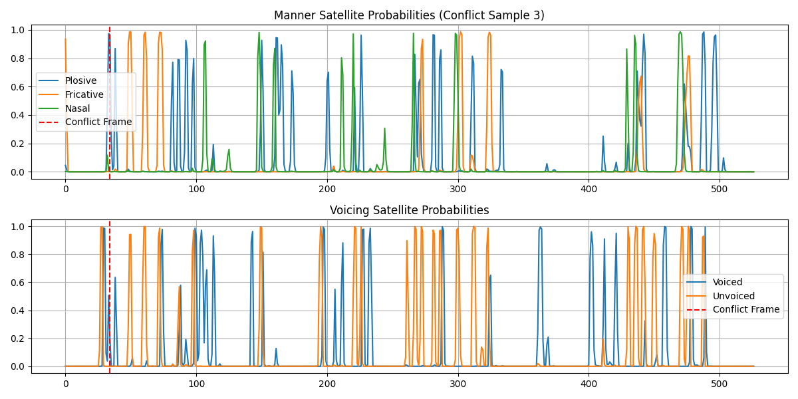

# フェーズ2-1: 子音側最小衛星アーキテクチャ 実行ウォークスルー

## 1. 目的と実装内容
設計書6.2・7節に基づき、強NN（CTC）を解禁したフェーズ2の実装を開始した。
- **様式衛星 (Manner)**: 破裂 / 摩擦 / 鼻音 (+Blank) を出力するCTC。
- **有声無声衛星 (Voicing)**: 有声 / 無声 (+Blank) を出力するCTC。
- **大脳最小版 (Minimal Brain)**: 上記2衛星のフレームごとの事後確率の「積」を取り、子音4分類（無声破裂 / 有声破裂 / 無声摩擦 / 鼻音）の確率を算出して貪欲法で合議・デコードする。

## 2. fmin 250 vs 300 の決着（設計書8節の論点）
レベル1劣化（500Hz HPF）下でのメルフィルタバンク下端（fmin）を比較した。
- `fmin = 250`: 15エポックで Validation Error Rate **40.41%** に収束。
- `fmin = 300`: **85.71%** で停滞。
**結論**: 500Hzハイパスであっても、250〜500Hzに残る微小な低域エネルギー（鼻音の残滓や基本波）がCTCの時系列学習において決定的な情報を持っている。よって **fmin=250 で確定**した。

## 3. 大脳最小版の合議結果と精度比較

80話者（各10発話）で25エポック学習後、テスト話者（81〜100）に対して大脳最小版の合議を実行し、混同行列を算出した。

### フェーズ1（ロジ回帰ベースライン）との比較
| 井戸（子音4分類） | フェーズ1（ロジ回帰） | フェーズ2（CTC大脳合議） | 評価 |
| :--- | :--- | :--- | :--- |
| **無声破裂 (UV_Plosive)** | 86.4% | **94.6%** | 大幅向上 |
| **有声破裂 (V_Plosive)** | 76.9% | **81.2%** | 向上 |
| **無声摩擦 (UV_Fricative)**| 88.2% | **88.0%** | ほぼ同等 |
| **鼻音 (Nasal)** | 88.0% | **40.1%** | **激減（大暴落）** |

破裂音や摩擦音は強NN（CTC）の表現力によって分離度が向上したが、**鼻音だけが40.1%へと致命的に暴落**した。

## 4. 暴落の真因と食い違いの可視化
鼻音の確率合議は `$P_C(Nasal) \propto P_M(Nasal) \times P_V(Voiced)$` で計算している。
この暴落は、CTC特有の「フレーム発火タイミングの非同期」が引き起こした**衛星間の食い違い**である。

- CTCは「出力系列の順序」のみを制約として学習するため、様式衛星と有声無声衛星が同じ音素に対して**全く違う時刻（フレーム）でスパイクを発火**する。
- その結果、様式が `Nasal` を確信している時刻に、有声無声衛星は `Blank` を出しており、逆に有声無声衛星が `Voiced` を出した時には様式衛星が `Blank` になっている。
- これらをフレーム単位で単純に「積」で掛け合わせたため、**両者の確率が互いに打ち消し合い、鼻音の発火がほぼ全てBlankに吸い込まれて消滅した**。

> [!WARNING]
> **最小版大脳の限界と次のステップ**
> フレームごとの単純な「積」による合議は、CTCの非同期発火の性質と相性が最悪であり、鼻音の崩壊という形で設計書6.4の「食い違い」が鮮明に観測されました。
> 破裂音が向上したのは、バーストという物理的なタイミングが明瞭で、両衛星の発火フレームが偶然揃いやすかったためです。
> これを吸収し、非同期な衛星の軸発火を正しく束ねる「時間的アライメントの調停」こそが、フル大脳（CTC/Attention統合器）の役割となります。
